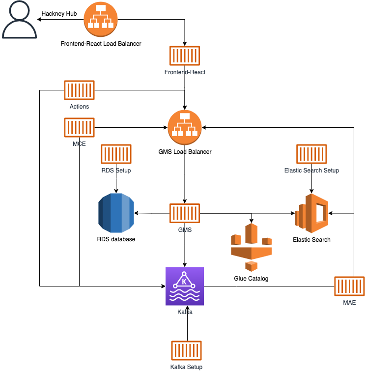

# Help File

### Accessing datahub in dev environment via Bastion Tunnel

#### Setup
If your bastion has been re-deployed or is new, you will need to setup a few bits to allow the SSH tunneling to work.
The guide presume you are using `aws-vault exec hackney-dataplatform-development -- aws ssm start-session --target i-*` to connect to the bastion
```shell
sudo su ec2-user
cd ~
ssh-keygen
```

`Enter file in which to save the key (/home/ec2-user/.ssh/id_rsa):` Just press enter

`Enter passphrase (empty for no passphrase):` Just press enter

`Enter same passphrase again:` You've guessed it, just press enter

```shell
cat ~/.ssh/id_rsa.pub >> ~/.ssh/authorized_keys
```

#### Start the Tunnel

```shell
ssh -i .ssh/id_rsa -L 9002:{datahub_frontend_load_balancer_dns_name}:9002 ec2-user@localhost -v
```

### Local Tunnel

```shell
aws-vault exec hackney-dataplatform-development -- aws ssm start-session --target {bastion_id} --document-name AWS-StartPortForwardingSession --parameters '{"portNumber":["9002"],"localPortNumber":["9002"]}'
```

### Architecture


